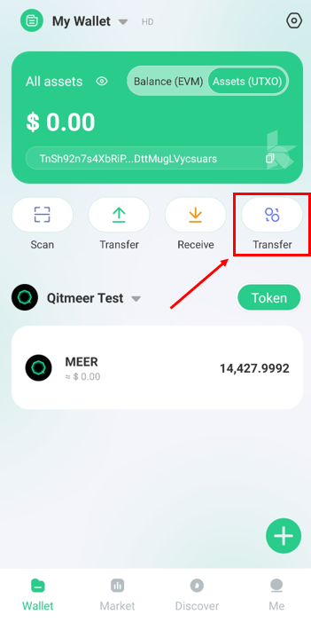
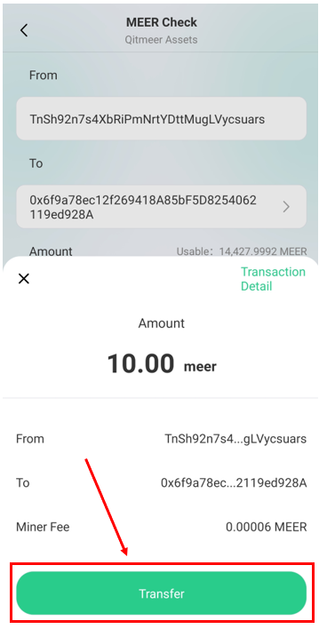
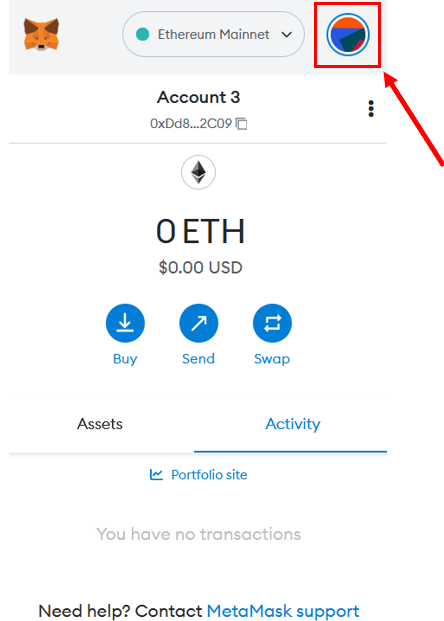
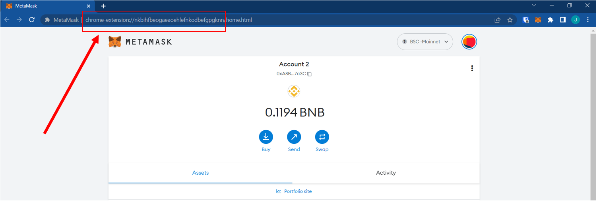
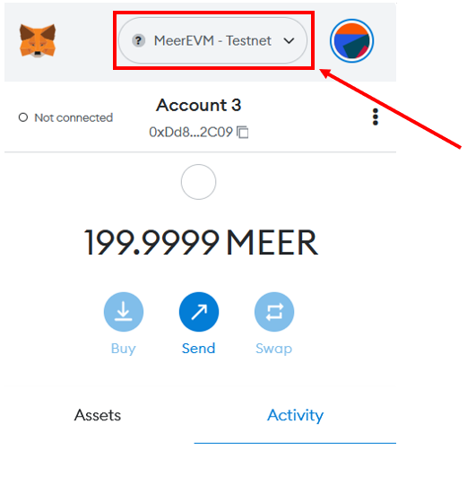
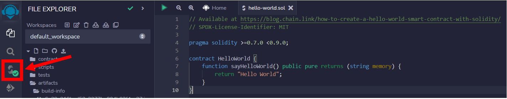
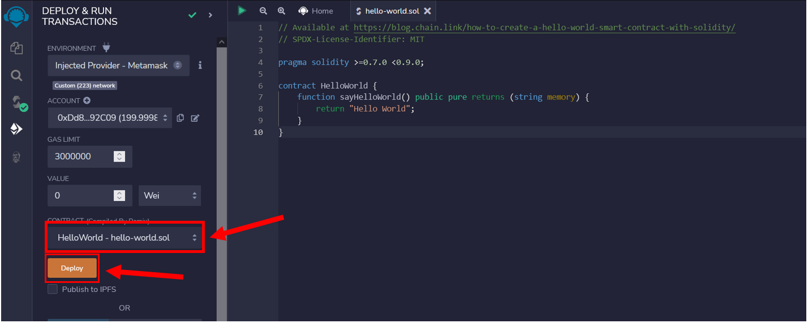
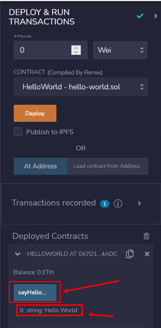

# meerEVM and deploying SmartContracts

## MeerEVM - setting up node

To interact with the MeerEVM (testnet), you would need to configure your MEER node by including both the `--testnet` and `--evmenv` flag and specifying the necessary parameters before starting the node.

Interacting with MeerEVM requires the client sending a series of JSON-RPC API methods to the node which can only be done by enabling a server on the node to accept JSON-RPC requests. 

Currently you can use the API via RPC through these protocols:
- **HTTP**
- **WebSocket**


### HTTP

To enable the HTTP server, you would need to insert the `--http` parameter inside of `--evmenv` flag: 

```bash
> ./qng --testnet --evmenv="--http"
```
> By default, the port number should be set to **18535** but this can be altered by modifying `--http.port=<port-number>`. For example, if you want to set the port number to 12345, then you would need to input the command: `./qng --testnet --evmenv="--http --http.port=1234"`

You can also specify the JSON-RPC API that you would like to use through the `--http.api` parameter: 

```bash
> ./qng --testnet --evmenv="--http --http.api=eth,net,rpc,web3,personal,debug"
```
> By default, only `eth`, `net`, `rpc` and `web3` API methods are provided if `--http.api` is not explicitly specified

### WebSocket 
To enable the WebSockets, you would need to insert the `--ws` parameter inside of `--evmenv` flag:

```bash
> ./qng --testnet --evmenv="--ws"
```
> Again, similar to HTTP, the port number by default is set to **18536**. This can be altered by `--ws.port=<port-number>`. For example, if you want to set the port number to 12345, then you would need to input the command: `./qng --testnet --evmenv="--ws --ws.port=12345"`

## *cli.sh*

*cli.sh* is a bash script that will allow you to run JSON-RPC methods on the Qitmeer UTXO network (**not MeerEVM**).

Before the running the script you must set the corresponding variables to match the settings of the Qitmeer UTXO RPC server running on the node:

- `$host` - IP address of host (default: **127.0.0.1**)
- `$port` - port number (default: **1234**)
- `$user` - username for RPC server (default: "**test**") 
- `$pass` - password for RPC server (default: "**test**")

> The port number for the Qitmeer RPC server is by default, set to **18131** unless changed otherwise. 

> Again, the configuration settings must match the RPC server for the Qitmeer network and not MeerEVM or what has been entered in the `--evmenv` flag.

If the default values do not correspond to those set on the node, then, they must be changed. You can alter the settings by issuing the following command:

```bash
export host=<host-IP> port=<port-number> user=<username> pass=<password>
```

It may be easier for you to simply change the default values on the script if your not going to change the values often. That way you don't have to worry about your environment variables being accurately set.

This could be done by modifying this portion of the script : 

```bash
// cli.sh - line 641

function get_result(){
  local proto="https"
  if [ $notls -eq 1 ]; then
     proto="http"
  fi
  if [ -z "$host" ]; then
     host=127.0.0.1
  fi
  if [ -z "$port" ]; then
     port=1234
  fi
  if [ -z "$user" ]; then
     user="test"
  fi
  if [ -z "$pass" ]; then
     pass="test"
  fi
```


## Cross-chain Exchange (Qitmeer -> MeerEVM)

It is possible to exchange your MEER coins from the Qitmeer UTXO network to MeerEVM.

### Method 1: Using KAHF Wallet

You can use the KAHF wallet app to easily transfer MEER from Qitmeer UTXO to MeerEVM


1. On the home page, click on the last icon labelled "Transfer"



2. Select the address you would like to send it to and enter the amount.

3. Click "Confirm" and enter your password or fingerprint (if this has been set up).

4. You should see the transaction details on the screen. Click on "Transfer" to finalise the transaction.




## Add MeerEVM to Metamask

You must have the **<a href="https://metamask.io/download/">Metamask browser extension</a>** installed before proceeding ahead. 

### Method 1: use public RPC node (easier option)
You can take advantage of a public RPC endpoint to deploy your smart contracts, rather than host the infrastructure yourself. 

The first thing to do is to add the MeerEVM network to your Metamask wallet.

Click on the Metamask browser extension icon and click on the circular icon on the top right:



Next click on Settings > Networks > Add Network

Add the following information to allow the wallet to connect to the RPC endpoint: 

- **Network Name**: MeerEVM - Testnet 
- **New RPC URL**: https://explorer.qitmeer.io/rpc
- **Chain ID**: 223
- **Currency Symbol**: MEER
- **Block Explorer URL**: https://testnet.qng.meerscan.io/

It should look something like this:


Finally, click on the "Save" button. Metamask will attempt to connect to the endpoint. If you do not encounter any errors then the process has been a success.

### Method 2: use own RPC node

If you would prefer to use your own node, you can configure Metamask to connect to your RPC endpoint using the same method mentioned above. 

1. The first step is to have the node running with the `--evmenv` flag enabled with the necessary parameters: `./qng --testnet --evmenv="--http --http.port=18545 --http.corsdomain=chrome-extension://nkbihfbeogaeaoehlefnkodbefgpgknn"`

> `--http.corsdomain` must be enabled, with the value equal to the URL of the client that wants to connect to our node. Although you can set the value to "*" to allow anybody to connect to the node, **this is generally bad practice and should only be done inside of a test environment or if you know what you are doing**!

To find the value of `--http.corsdomain`, click on the Metamask icon and click on account options:


Click on "Expand View" and copy the URL of the address bar. You should see it starting with `chrome-extension://` or `moz-extension://` and copy the URL but removing the `/home.html` part




2. Add the network to the Metamask wallet using the previous method outlined above. Only the "**New RPC URL**" value should be changed with the remaining parameters being the same as above.

3. Click on the "Save" button. Metamask will attempt to connect to the endpoint. If you do not encounter any errors then the process has been a success. 

## Deploy Smart Contract on MeerEVM

In this section we will attempt to deploy a "Hello World" smart contract on MeerEVM. In this example we will be using <a href="https://remix.ethereum.org/">Remix IDE</a> although you can use any library or development environment (such as Hardhat, Truffle etc.) to complete this task.

The contract we will attempt to deploy is:
```
// Available at https://blog.chain.link/how-to-create-a-hello-world-smart-contract-with-solidity/
// SPDX-License-Identifier: MIT

pragma solidity >=0.7.0 <0.9.0;

contract HelloWorld {
    function sayHelloWorld() public pure returns (string memory) {
        return "Hello World";
    }
}
```

### Connect Metamask to Remix IDE

1. Select the right network for your Metamask wallet. This should be "MeerEVM - Testnet" (or whatever you decided to call it)



2. Next visit the <a href="https://remix.ethereum.org">Remix IDE</a> website and click on the "Deploy and run transactions icon"


3. Click on the "Environment" tab and select "Injected Provider - Metamask". You should recieve a pop-up from Metmask asking whether you would like to connect your wallet. You should click accept. If it was successful, you should not see any errors.


4. Click on the "File Explorer" tab, click on "Create new file" and name it `hello-world.sol` and copy and paste the following code:
```
// Available at https://blog.chain.link/how-to-create-a-hello-world-smart-contract-with-solidity/
// SPDX-License-Identifier: MIT

pragma solidity >=0.7.0 <0.9.0;

contract HelloWorld {
    function sayHelloWorld() public pure returns (string memory) {
        return "Hello World";
    }
}
```


5. Press CTRL + S to compile your contract. You should see a tick if the contract was compiled successfully. 



6. Click on the "Deploy and run transactions tab" and select the "hello-world.sol" smart contract. Click "deploy" to deploy onto MeerEVM. You should get a prompt by Metamask asking whether you would like to confirm the transaction. Click "accept". 



We can view our transaction on the MeerEVM Testnet Explorer: https://testnet.qng.meerscan.io/tx/0xbf52631a396aaac1f90c58ee721e5c0c09882564ab2f2e3c52444804780695ca


7. Contracts that have been deployed will appear in the "Deployed Contracts" section. Click on the "sayHelloWorld" button to call the function. The output should appear below as `0:string:Hello World`




> As `sayHelloWorld()` is a pure function, in this instance, a transaction will not be created unlike the contract creation process.


